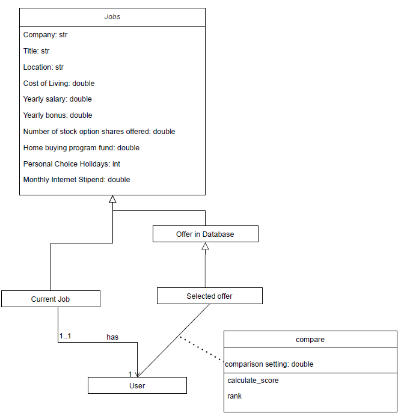
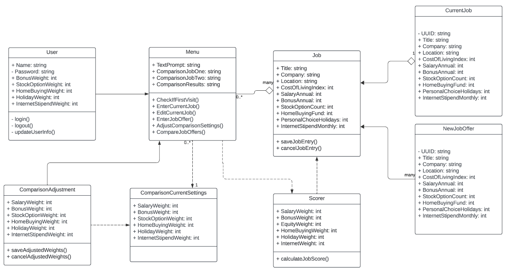
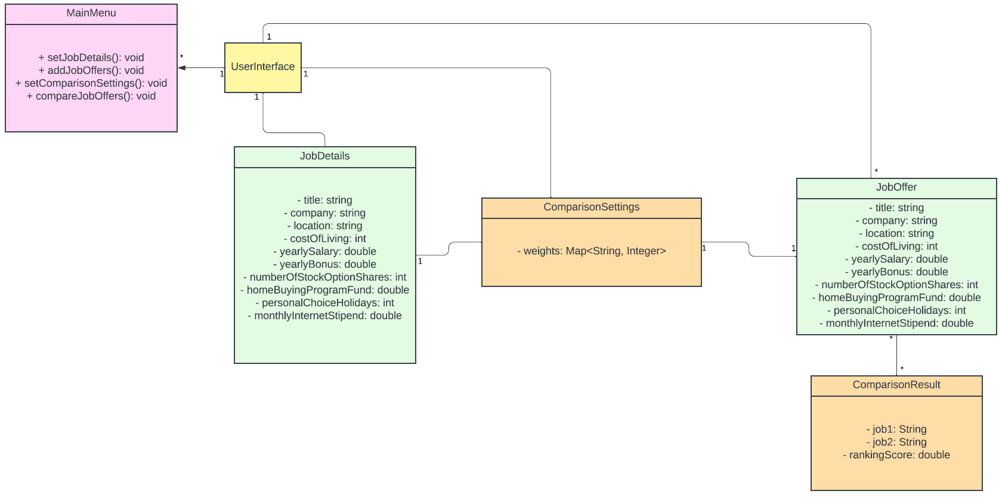
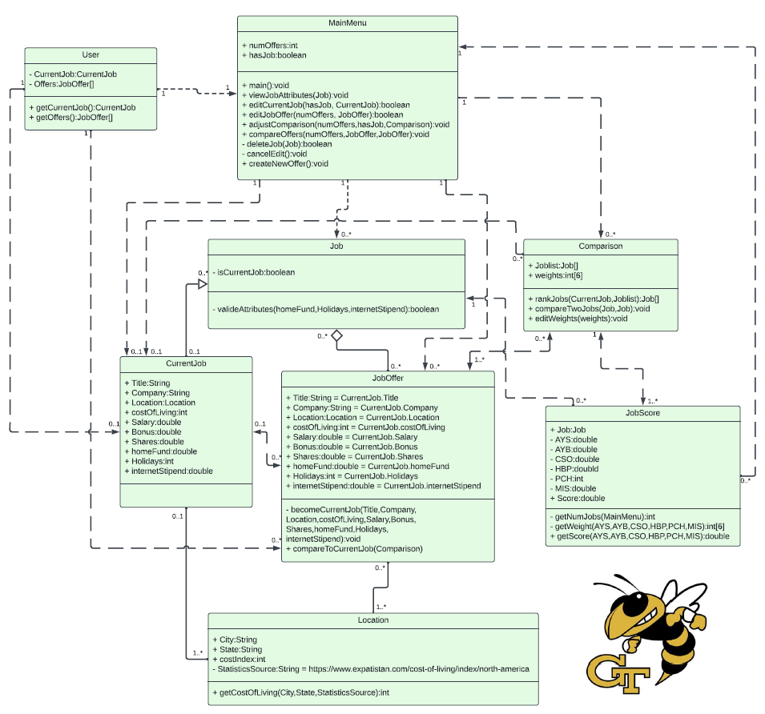
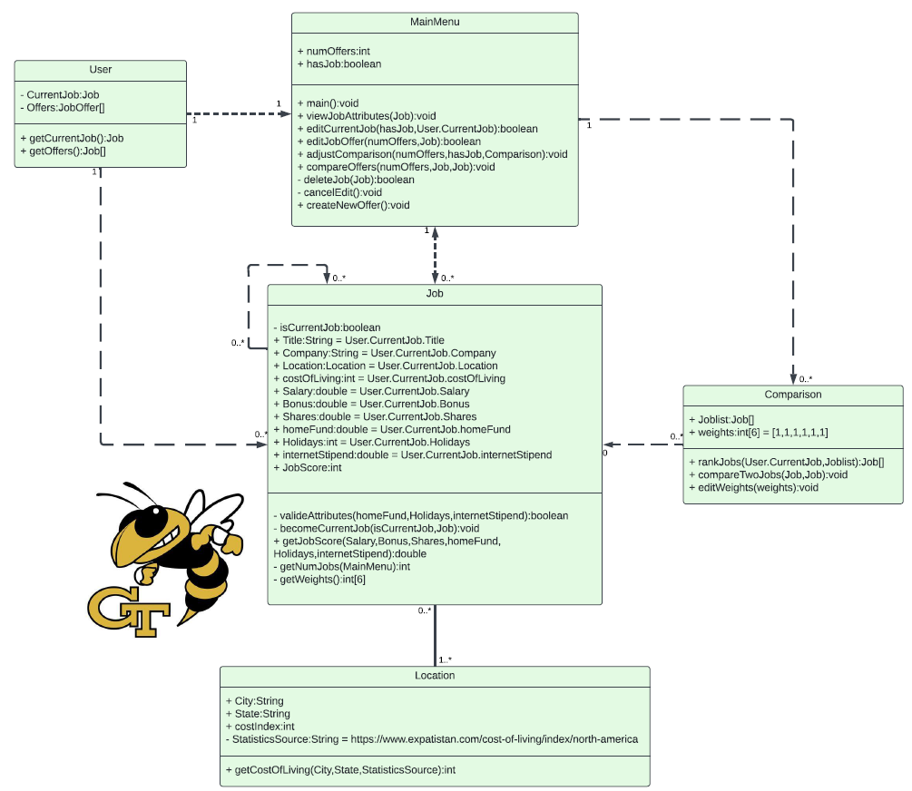

CS6300: Software Design Process
Georgia Institute of Technology
Spring 2024
Team 186: Matthew Preston, Zixin (Wendy) Feng, Sabab Karim, Gannon McCollum
Deliverable 1: Preliminary Work

### Individual Designs

#### Design 1 “Wendy” 

Pros: Clear and concise, covers most requirements, adheres to Professor Orso's lecture design, incorporates essential classes at ED lessons. 
Cons: The straightforward approach makes it challenging to identify the system's entry point, and lacks sufficient attributes or methods, including entry points and details of comparison methods – weights. 

#### Design 2 “Gannon”

Pros: Highly specific, comprehensive, well-structured classes with explicit relationships and attributes.
Cons: Repeated attributes across different classes. For instance, weights currently function as attributes for users too. An improved approach might involve designating these weights as default_weight attributes, especially if no new weights have been added for returning clients.

#### Design 3 “Sabab”

Pros: Good design with fairly enough detail to understand the flow of the relationships and attributes; Covers most requirements.
Cons: The clarity is lacking in the 1-to-many and 1-to-1 relationships. The JobOffer class repeats the same variable, potentially causing bloating and increased memory usage. The JobOffer class may lead to inefficiencies as more job offers are added, resulting in increased memory usage, which is suboptimal as each instance continues to compare more than necessary. UserInterface, included as a wildcard, lacks a defined role due to the absence of attributes. 

#### Design 4 “Matthew”

Pros: Design with extensive detail and clarity, presents an list of attributes and classes that effectively delineate the relationships between all entities. The inclusion of the Location class stands out for its neatness, enabling the calculation of the cost of living by interfacing with an external website.
Cons: Due to the level of detail, hard to understand the relationship links; some extra attributes or classes that can be combined. However, after explanation, it is easy to understand and follow.

### Team Design

#### Commonality: 
Simplicity: Our UML design emphasizes simplicity with detail. This included clearly defined relationships, easy to read, and limit repeating attributes. 
Our UML design comprehensively addresses the primary requirements outlined in the assignment.

#### Differences: 
Each design contributes distinctive value by capturing elements that might be overlooked by others. Matthew's design, for instance, adeptly incorporates the zip code setting. Gannon's contribution is marked by the inclusion of the UID setting for job offers. Wendy's design stands out for its focus on necessary simplicity, while Sabab's design skillfully captures the entry point that links all components together. 

#### Final decision: 
Utilizing the feedback from all four individual designs, we went with Design 4 over the other individual designs as the level of detail allowed us to start with a good base and then go from there. We slimmed down the design a fair bit and included only essential classes, attributes, and methods. For example, we condensed the Job classes from Design 4 into 1 Job class. 
A couple differences between Team Design and other individual designs, specifically Design 4, is decreasing the amount of repeating attributes and any superfluous classes as well as increasing the complexity a bit to include enough detail to capture requirements. 

### Summary

We have gained valuable insights in terms of design and teamwork.
#### Design:
Each design brings unique value by capturing elements that others may overlook. The diversity of these considerations showcases the comprehensive and collaborative nature of the team's approach, highlighting the richness that each team member brings to the design process.

#### Teamwork:
The team's discussion proves highly effective due to the thorough preparation of all members before each meeting. Each team member comes well-equipped with knowledge of UML, a clear understanding of group assignment requirements, and familiarity with the work of their peers. This level of preparedness not only facilitates a deeper exploration of content but also allows the team to efficiently cover more ground within the constraints of limited time. The collaborative effort and commitment to readiness contribute to the overall success and productivity of the team's discussions.
Each team member leverages their individual strengths within the group. Some excel in technical aspects, while others are adept at communication and summarizing ideas. We are committed to harnessing everyone's strengths and fully respecting each other's preferences.
